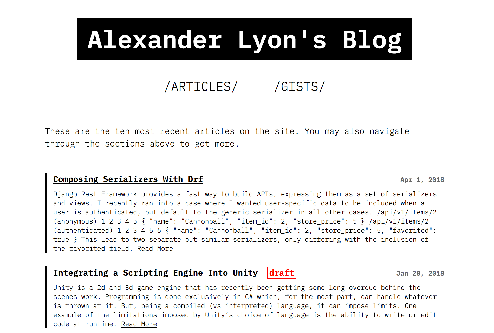

# CAPSLOCK

CAPSLOCK is a simple hugo theme for blog-like websites. It allows for good flexibility without
having to jump behind and edit the theme directly, and supports a few extra archetypes out of 
the box such as gists and projects. To see an example site, visit https://github.com/arlyon/arlyon.co



### Features

- Draft Indicator.
- Tags and Categories.
- Gist Archetype.
- Project Archetype.
- Customizable fore- and background colors.
- Optional read time.
- Optional (and flexible) font awesome integration.

### Getting Started

To get started, you can clone the repo.

    git clone https://github.com/arlyon/CAPSLOCK.git themes/CAPSLOCK
    
or 

    git submodule add https://github.com/taikii/whiteplain.git themes/whiteplain
    
Then, edit your configuration file to set `CAPSLOCK` as the theme. Additionally, you
can set some of the extra settings, laid out below.

```toml

# Theme Settings

theme = "CAPSLOCK"

# googleAnalytics = ""
sectionPagesMenu = "main"
pygmentsOptions = "linenos=inline"
pygmentsStyle = "bw"

[params]
    show_read_time = true
    show_contact_in_head = true
    show_contact_in_footer = true
    fontawesome_sets = ["brands", "solid"]
    copyright = "no monkeys (or typewriters) were harmed in the making of this site"

[[params.contact]]
    icon_type = "fab"
    icon_name = "github"
    link = "https://www.github.com/arlyon/"

[[params.contact]]
    icon_type = "fab"
    icon_name = "twitter"
    link = "https://www.twitter.com/_arlyon/"

[[params.contact]]
    icon_type = "fas"
    icon_name = "envelope"
    link = "mailto:arlyon@me.com"

```
  
Finally, you can explore some of the achetypes and get started.

### Supported Archetypes

#### Gists

To create gists you can use the command `hugo new gists/code.md` and a new post of the
gist archetype will be created. After that, simply edit the user and gist ids and the
gist in question will be rendered onto the page.

#### Projects

To create a "project" you simply need to run the command `hugo new projects/mine.md` and
the project archetype will be used. In the project archetype there is a demo and source
field in the front matter that will appear on the page as a button.

### Some Tips

- To set the "blurb" for each section, create an `_index.md` file in either the content root
or one of the archetype folder. It will be included in the "list" view for that archetype.

- To customize the color scheme you can create a `static/css/custom.css` file and set some 
CSS variables in it. This will override the default black and white color scheme with the 
colors you define. `custom.css` is loaded by the theme so anything you don't like otherwise
can be overridden there also.

```css
:root {
    --foreground: orange;
    --foreground-08: rgba(255,165,0, 0.8);
    --foreground-03: rgba(255,165,0, 0.3);
    --foreground-01: rgba(255,165,0, 0.1);
    --foreground-005: rgba(255,165,0, 0.05);

    --background: black;
}
```
      
- Adding contact info is easy! Have a look at the config above for some examples, and make 
sure the files are added under the `fontawesome_sets` property in the params. The available
sets in font awesome free are `brands`, `regular`, and `solid` (accessed in the html as `fab`,
`far` and `fas` respectively). Look here to see the [available fonts](https://fontawesome.com/icons)!

- You can set a copyright message in the footer by adding the right param in the config. Refer
to the example above for how to do it.
