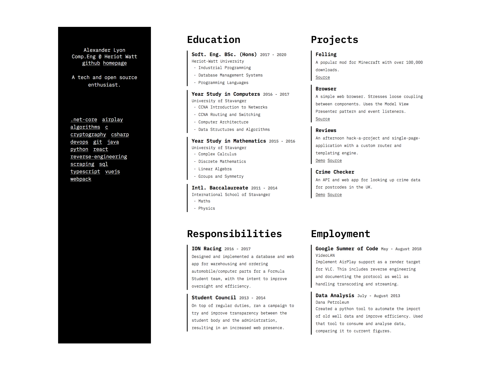

# CAPSLOCK

CAPSLOCK is a simple hugo theme for blog-like websites. It allows for good flexibility without
having to jump behind and edit the theme directly, and supports a few extra archetypes out of 
the box such as gists and projects. To see an example site, visit https://github.com/arlyon/arlyon.co

### Blog Mode


### CV Mode



## Features

- Draft Indicator.
- Tags and Categories.
- Archetypes:
    - articles
    - gists
    - projects
    - employment
    - education
    - responsibility
    - cover letter
- Customizable fore- and background colors.
- Optional read time.
- Optional (and flexible) font awesome integration.
- Netlify HTTP/2 headers for css
- CV Mode
    - full tagging to list technologies
    - optional "pinning" so that not everything is on the dashboard
- Web Manifest and Favicon Support
- Service worker and offline mode

## Getting Started

To get started, you can clone the repo.

    git clone https://github.com/arlyon/CAPSLOCK.git themes/CAPSLOCK
    
or 

    git submodule add https://github.com/arlyon/CAPSLOCK.git themes/CAPSLOCK
    
Then, edit your configuration file to set `CAPSLOCK` as the theme. Additionally, you
can set some of the extra settings, laid out below.

```toml
# Theme Settings

theme = "CAPSLOCK"

# googleAnalytics = ""
sectionPagesMenu = "main"
pygmentsOptions = "linenos=inline"
pygmentsStyle = "bw"
pygmentsUseClasses = true
pygmentsCodeFences = true

[params]
    author = "Alexander Lyon"
    description = "A resume."
    foreground = "#000"
    show_read_time = true
    show_contact_in_head = true
    show_contact_in_footer = true
    foreground = "#000"
    service_worker = true
    fontawesome_sets = ["brands", "solid"]
    copyright = "no monkeys (or typewriters) were harmed in the making of this site"

[params.cv]
    enabled = true
    sections = ["projects", "employment", "education", "responsibilities"]

[params.cv.data]
    location = "Edinburgh"
    site = "https://blog.arlyon.co"
    email = "arlyon@me.com"
    github = "arlyon"
    gitlab = "git.arlyon.co"
    currently = "Comp.Eng @ Heriot Watt"
    blurb = "A tech and open source enthusiast."

[[params.contact]]
    icon_type = "fab"
    icon_name = "github"
    link = "https://www.github.com/arlyon/"
    text = "GH"

[[params.contact]]
    icon_type = "fab"
    icon_name = "twitter"
    link = "https://www.twitter.com/_arlyon/"
    text = "TW"

[outputs]
    home = [ "HTML", "RSS", "HEADERS" ]
    page = [ "HTML" ]

[mediaTypes]
    [mediaTypes."text/netlify"]
    suffixes = [""]
    delimiter = ""

[outputFormats]
    [outputFormats.HEADERS]
    mediatype = "text/netlify"
    baseName = "_headers"
    isPlainText = true
    notAlternative = true
```

### CV Mode

The theme supports "CV mode" that takes a set of data and displays it. The data is split into categories, an example of
which you can find [here](https://github.com/arlyon/resume). It is unique in that it is possible to write cover letters
that can be inserted dynamically into the document alongside the CV. This means that it is possible to write cover letter
documents for each potential application.

### Favicons

To get your favicons up and running, simply go step by step through [this generator](https://realfavicongenerator.net/)
and paste the resulting files into the `/static/favicons/` folder. They will be picked up automatically by CAPSLOCK. 
The theme colors are determined by the foreground site parameter.

### Service Worker

There is a service worker configured to cache pages and enable offline use under the site parameters.
If you want to use it, simply enable this setting. You will need a `site.webmanifest` in the favicons folder
to enable the service worker, as well a file `offline.md` in your `content` folder with a message to display
when the device tries to reach an un-cached page while offline.

```markdown
+++
title = "Offline"
type = "offline"
+++

# Sorry, You're Offline

The requested page isn't cached on this device. To keep reading, please reconnect 
to the internet and reload the page.
```

Powered by [Offline First SW](https://github.com/wildhaber/offline-first-sw)

## Archetypes

### Article

An article is similar to the default but adds tags and categories.

### Gists

To create gists you can use the command `hugo new gists/code.md` and a new post of the
gist archetype will be created. After that, simply edit the user and gist ids and the
gist in question will be rendered onto the page.

### Projects

To create a "project" you simply need to run the command `hugo new projects/mine.md` and
the project archetype will be used. In the project archetype there is a demo and source
field in the front matter that will appear on the page as a button.

### Cover letters

Cover letters are unique in that they display alongside your CV allowing you to write and send customized
CVs to specific employers.

## Tips

- To set the "blurb" for each section, create an `_index.md` file in either the content root
or one of the archetype folder. It will be included in the "list" view for that archetype.

- To customize the css you can create a `assets/scss/custom.scss` file and set some 
SCSS variables in it. This will override the default css with the styles you define.
      
- Adding contact info is easy! Have a look at the config above for some examples, and make 
sure the files are added under the `fontawesome_sets` property in the params. The available
sets in font awesome free are `brands`, `regular`, and `solid` (accessed in the html as `fab`,
`far` and `fas` respectively). Look here to see the [available fonts](https://fontawesome.com/icons)!

- You can set a copyright message in the footer by adding the right param in the config. Refer
to the example above for how to do it.

- To automatically generate the proper HTTP/2 headers for netlify, simply add this to your site
config:

```toml
[outputs]
    home = [ "HTML", "RSS", "HEADERS" ]
    page = [ "HTML" ]

[mediaTypes]
    [mediaTypes."text/netlify"]
    suffix = ""
    delimiter = ""

[outputFormats]
    [outputFormats.HEADERS]
    mediatype = "text/netlify"
    baseName = "_headers"
    isPlainText = true
    notAlternative = true
```

Good luck and feel free to open an issue if you have any ideas, problems or fixes.
